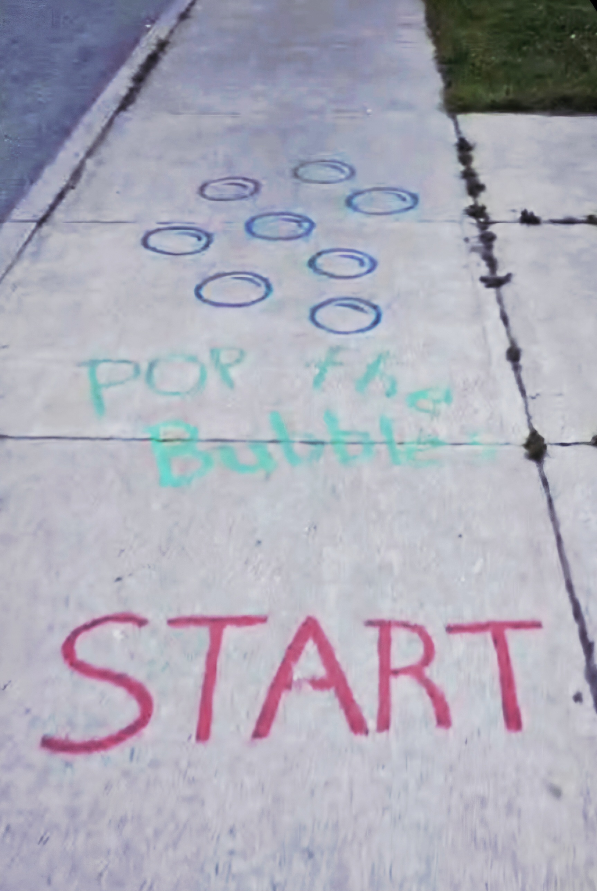
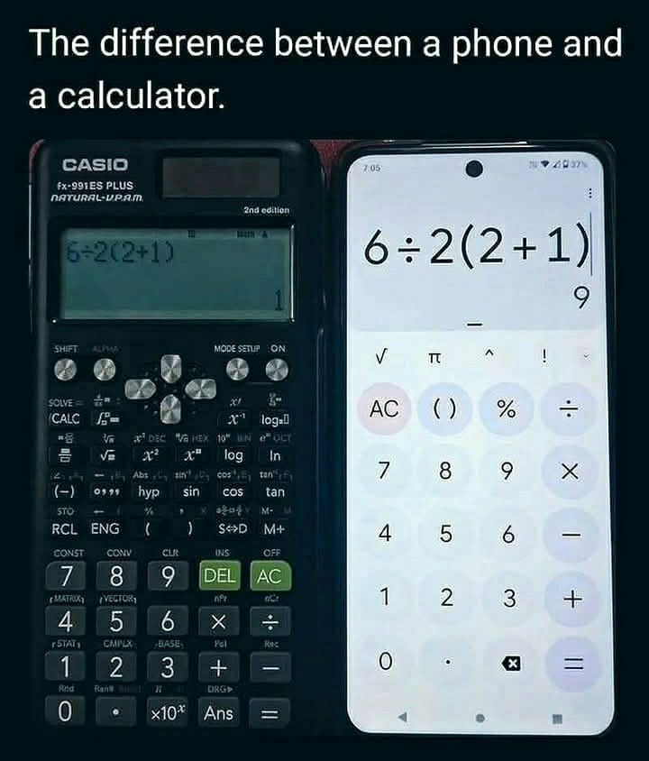
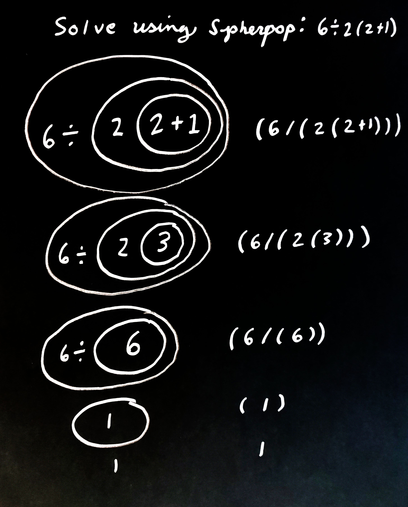
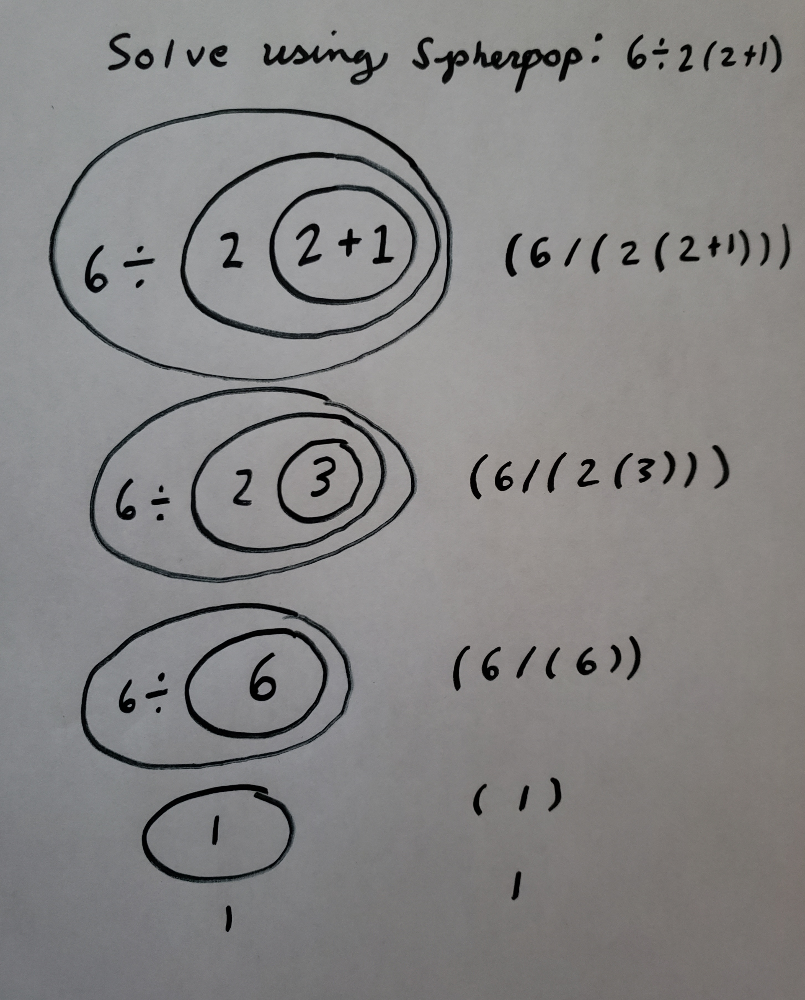
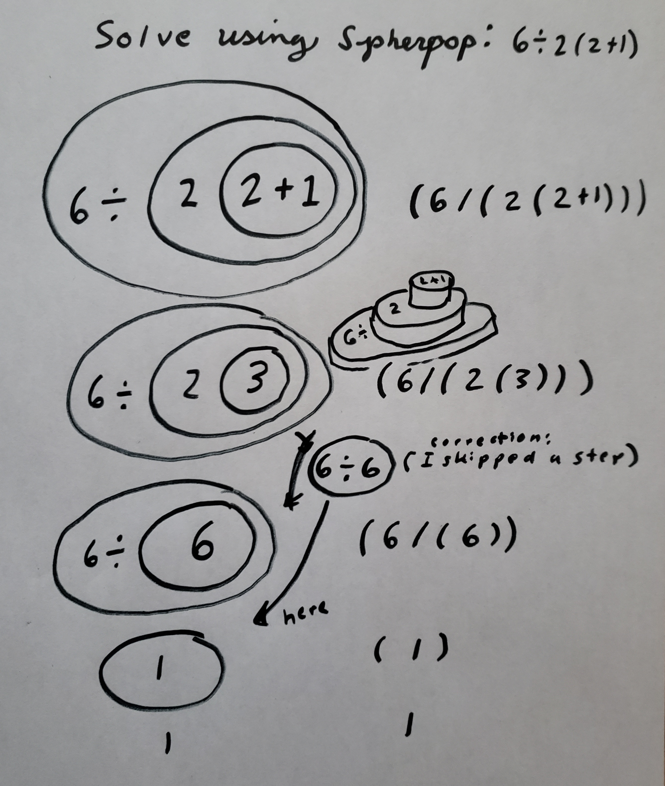
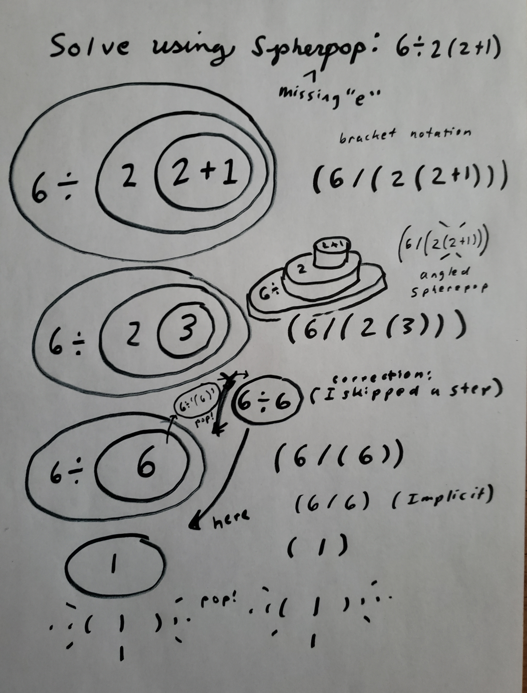
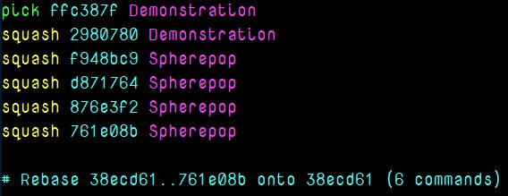
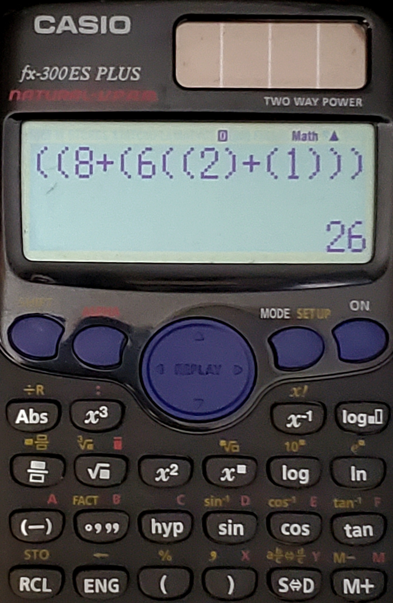

# Spherepop

( 6 / 2 ( 2 + 1 ) )

<!-- # Standard Galactic -->

## Spherepop Demo

<!--

-->

<!--

-->

# SpherePop: Visual and Categorical Perspectives on Interactive Expression Evaluation

## Overview and Examples

SpherePop is an interactive visual language and interpreter in which algebraic or logical expressions are instantiated as nested topological circles ("bubbles"). Each circle corresponds to a syntactic or semantic scope. The act of “popping” a bubble constitutes the explicit evaluation and reduction of the local subexpression it encloses. The user initiates evaluation by interacting directly with the visual representation; computation is neither implicit nor automated, but proceeds by explicit traversal of the expression’s abstract syntax tree (AST).

### Example 1: Arithmetic Reduction

Consider the arithmetic expression:

    (((1 + 2) + 3) + 4)

In SpherePop, this expression is visualized as a series of concentric or nested circles, each representing a level of nesting in the expression. The evaluation proceeds as follows, with each step corresponding to the popping (explicit evaluation) of the innermost available bubble:

1. **Initial state:** (((1 + 2) + 3) + 4)
2. **First pop:** (1 + 2) → 3, so the expression becomes ((3 + 3) + 4)
3. **Second pop:** (3 + 3) → 6, so the expression becomes (6 + 4)
4. **Third pop:** (6 + 4) → 10, so the expression becomes 10 (fully reduced).

### Example 2: Multiple Independent Subexpressions

    (((1 + 2) + (3 + 4)) + (5 + 6))

Evaluation proceeds by finding and popping the innermost bubbles:

1. **Initial state:** (((1 + 2) + (3 + 4)) + (5 + 6))
2. **Innermost pops:** (1 + 2) → 3, (3 + 4) → 7, (5 + 6) → 11
3. **Next pop:** (3 + 7) → 10
4. **Final pop:** (10 + 11) → 21

### Example 3: Variable and Function Application

    ((sqrt(16) + pow(2, 3)) / (factorial(3) - 2))

Evaluation:

1. sqrt(16) → 4, pow(2, 3) → 8, factorial(3) → 6
2. (4 + 8) → 12, (6 - 2) → 4
3. (12 / 4) → 3

### Example 4: Symbolic and Algebraic Manipulation

    ((a + b) * (c + d)) + ((e + f) * (g + h))

Variables are visually shown in the interface; the user may assign values and pop bubbles to observe the unfolding computation.

---

## Design Inspiration

The conception of SpherePop arises from a confluence of intuitive, cultural, and computational motifs. At its most immediate, the interface is inspired by the universal, tactile satisfaction of blowing and popping bubbles—a physical act that is accessible, direct, and inherently joyful. This metaphor is not merely decorative; it is structurally foundational, mapping the notion of “popping” directly onto the process of explicit scope reduction and evaluation within an expression.

Cinematically, SpherePop draws upon the motif of the chain reaction at the core of destructive events, most notably the detonation of a reactor core as depicted in both the destruction of the Death Star in *Star Wars* and the pivotal level mechanics of the video game *Descent*. In these narratives, the protagonist must penetrate to the innermost locus of a complex structure, initiate a catalytic process, and witness its effects propagate outward—a direct analogue to the traversal and evaluation of nested scopes within a computational expression.

From a programming languages perspective, SpherePop is motivated by the conceptual clarity of scope resolution: the act of descending into nested environments or contexts to resolve meaning or trigger computation, which is a central idea in both functional programming (e.g., S-expressions, lambda calculus) and shell scripting (e.g., nested bash shells, subshells, and process substitution).

Each evaluation in SpherePop is thus not just a computational event, but a dramatization of the journey from local action to global consequence. The visual and interactive paradigm foregrounds both the process and the result, making the abstract traversal of syntax trees and reduction of expressions tangible, observable, and pedagogically potent.

---

## Mathematical and Theoretical Foundations

### 1. Abstract Syntax and Topological Representation

SpherePop maps the AST of an expression onto a topological arrangement of nested circles. Each circle (or "bubble") is a visual metaphor for a syntactic scope or subexpression. This direct mapping provides an immediate visual intuition for the concept of scope, nesting, and reduction order.

#### 1.1. Category-Theoretic Interpretation

Each bubble can be regarded as an object in a category of expressions, with morphisms corresponding to evaluation steps. The reduction of a subexpression is a morphism from the object (unevaluated) to its value (evaluated), and the whole computation can be viewed as a composition of such morphisms traversing the AST from leaves to root.

#### 1.2. Sheaf-Theoretic Analogy

Analogous to stalks in a sheaf, each bubble contains local data (the subexpression). Popping a bubble corresponds to taking a section over a local neighborhood and gluing the result into the parent context, reflecting the local-to-global principles central to modern mathematics.

### 2. Operational Semantics

#### 2.1. Explicit, User-Guided Evaluation

Unlike conventional interpreters that apply reduction strategies automatically (e.g., eager, lazy, or normal order evaluation), SpherePop enforces explicit, user-driven computation. The user must select which bubble to pop, making the evaluation order transparent and controllable.

#### 2.2. Depth-First, Local-to-Global Reduction

Evaluation proceeds in a depth-first manner: the system enforces that only the innermost, fully reduced bubbles can be popped. This corresponds to a post-order traversal of the expression tree and is formally analogous to the evaluation of S-expressions in Lisp, or normal-order reduction in lambda calculus.

### 3. Visualization of Scope and Type

Scope boundaries are visually enforced by the concentric or nested arrangement of bubbles. The type system—currently visualized by color or annotation—can be extended to represent richer type theories, with each bubble’s style encoding its syntactic or semantic role (number, operation, variable, function, etc.).

### 4. Extensibility and Higher Structures

#### 4.1. Functional Abstractions

The framework admits natural extension to higher-order functions, recursion (fixed-point combinators), and user-defined abstractions. Function bubbles can encapsulate reusable computational structures, and their evaluation can be visualized as unfolding or inlining within the bubble diagram.

#### 4.2. Functorial Actions and Endofunctors

One may formalize evaluation strategies as functorial actions on the category of expressions, where each evaluation morphism is an endofunctor mapping expressions to their reduced forms.

#### 4.3. Sheafification and Gluing

Further abstraction may allow for the explicit modeling of sheafification: gluing together local reductions into a coherent global evaluation, exploring the role of locality and context in computation.

### 5. Pedagogical and Research Applications

SpherePop provides a concrete instantiation of abstract computational principles, making it a potent tool for teaching:

- Order of operations and evaluation strategies
- Abstract syntax trees and scope management
- Local-to-global reasoning in mathematics and computation
- Foundations of category theory and sheaf theory
- Visual programming and interactive computation

---

## Future Directions

- **Function Definition and Higher-Order Computation:** Visual creation and evaluation of reusable function bubbles.
- **3D Visualization:** Mapping expressions to higher-dimensional topologies (e.g., true spheres in 3D space) for richer encodings of scope and dependency.
- **Type-Theoretic Visualization:** Integration of advanced type systems and dependent types, with visual cues for type inference and checking.
- **Dual Textual/Visual Interface:** Bidirectional mapping between textual expressions (Lisp-like or algebraic syntax) and visual bubble structures.
- **Functorial and Sheaf-Theoretic Research:** Formalization of evaluation as functorial transformations and explicit gluing of local evaluations.

---

## Conclusion

SpherePop is not merely a visual programming interface; it is a formal exploration of the intersection between computation, topology, and category theory. By making computation explicit, visual, and interactive, it offers new pedagogical opportunities and opens avenues for research into the foundations of computation as manifested in mathematical structure.

<!--

Try the [Galactic Translator](https://standardgalactic.github.io/sga-converter.html)

And [Typing Tutor](https://standardgalactic.github.io/typing-tutor)

Play [Chrobatos](https://standardgalactic.github.io/chrobatos.html)

And [Color Radio](https://standardgalactic.github.io/color-radio.html)

Coming soon:

[Centerfuge](https://standardgalactic.github.io/Centerfuge)

Spherepop in Action

SPHEREPOP: THE PROGRAMMING LANGUAGE THAT BROKE REALITY (AND YOUR BRAIN)

[Opening shot: A dark void, punctuated by glowing, pulsating bubbles. A low, ominous synth hum fills the air.]

NARRATOR (gravelly, dramatic):
In a world where programming has always been confined to the cruel, unyielding walls of text…

[Flash of a frustrated programmer smashing a keyboard. Cut to green terminal code scrolling violently.]

Where mere mortals struggle to decipher endless lines of cryptic gibberish…

[Close-up of a screen filled with impenetrable Lisp code. A horrified programmer gasps.]

…One language dares to ask: What if programming… was a game?

[Music swells. The screen erupts in a cascade of shimmering spheres, expanding and colliding in a hypnotic dance.]

NARRATOR:
Introducing… SPHEREPOP.

[Cut to a man in a lab coat, eyes wild with the kind of unhinged genius usually reserved for doomsday prophets.]

SCIENTIST (yelling over flashing lights):
"We thought we could contain it… But the bubbles! They keep GROWING!"

[Montage: A programmer frantically popping spheres, numbers flashing, logic bending, reality warping.]

NARRATOR:
It’s not just a language. It’s an experience.

No brackets. No semicolons. Just… spheres. Infinite, undulating spheres, holding the secrets of the universe.

[A man collapses, sobbing, as a perfectly nested sphere structure unfolds before his eyes.]

"My god… it’s… beautiful."

[Cut to a shadowy government agent slamming a folder onto a table labeled "CLASSIFIED: SPHEREPOP INCIDENT"]

AGENT:
"If this technology gets out… civilization may never write for (int i = 0; i < n; i++) again."

[Chaotic flashes: A hacker cackling as he bypasses a firewall with a single bubble pop. A university professor throwing a textbook out the window. A game developer whispering, “We were fools.”]

NARRATOR:
This summer… prepare for the paradigm shift NO ONE WAS READY FOR.

Spherepop: Because programming should be incomprehensible AND look pretty while doing it.

[Title card explodes onto the screen. The tagline glows underneath:]
"POP THE CODE. SHAPE THE FUTURE."

[Final shot: A lone sphere, floating in the void. A single finger reaches out… and pops it. Cut to black.]

COMING SOON. OR NEVER. WHO KNOWS?
-->
