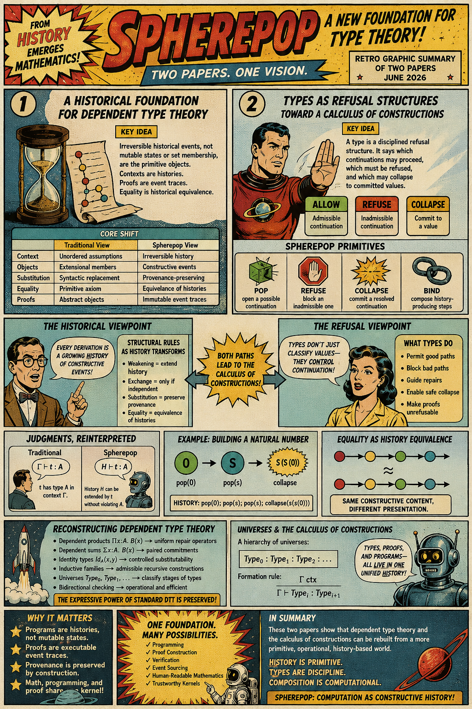
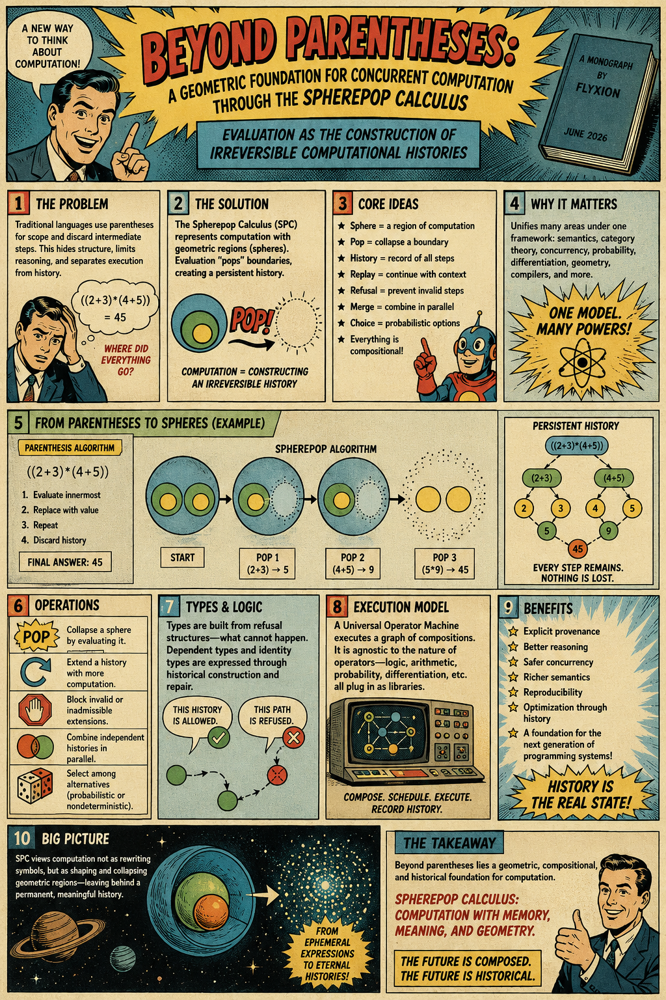

[Beyond Parentheses](https://standardgalactic.github.io/spherepop/textbook/beyond-parentheses.pdf)

[A Historical Foundation for Dependent Type Theory](https://standardgalactic.github.io/spherepop/textbook/dependent-type-theory.pdf)

[Types as Refusal Structures](https://standardgalactic.github.io/spherepop/textbook/refusal-structures.pdf)

# The Ecology of Thought

[Manuscript](https://standardgalactic.github.io/spherepop/textbook/ecology-of-thought.pdf)

> *The environment is not merely where thinking happens—it is part of the computational substrate from which thinking emerges.*

This repository explores the idea that workspaces, libraries, and digital environments should function as **history-preserving cognitive habitats** rather than passive archives. Instead of optimizing only for storage and retrieval, these essays examine how persistent environments preserve context, reduce reconstruction costs, and sustain long-term intellectual work.

## Contents

* [Stop Cleaning Your Desk](blog-post.md) — An introduction to the ecology of thought and the role of external environments in cognition.
* [The Ecology of Thought: A Guide to Temporal Stratification in Memory Registers](thinking-machine.md) — Architectural, project, and state registers as layers of external memory.
* [From Archive to Habitat](cognitive-environments.md) — The transition from document-centered systems to inhabited knowledge environments.
* [Architecting the Cognitive Habitat](knowledge-environments.md) — A proposal for history-preserving knowledge systems and persistent cognitive media.
* [Strategic Design Assessment](cognitive-utility.md) — An analysis of workspace design from the perspective of cognitive utility and long-term intellectual continuity.

## Core Ideas

* History is computational.
* Navigation complements retrieval.
* Stable environments preserve context.
* Unfinished work maintains momentum.
* Knowledge systems should preserve processes as well as results.

> *The central proposal is simple: future knowledge systems should remember not only what we know, but how we came to know it.*
